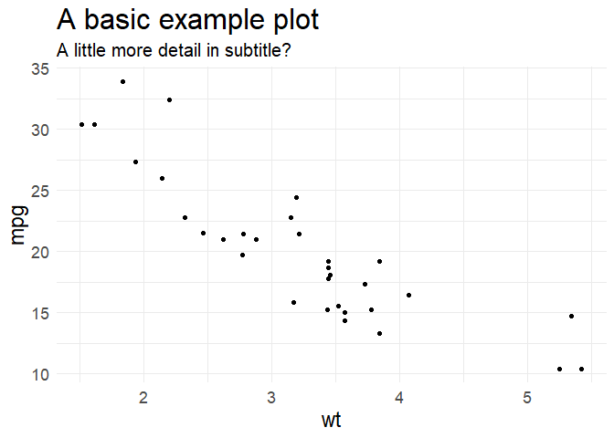

<!-- README.md is generated from README.Rmd. Please edit that file -->

## learylib 

<!-- badges: start -->

[](https://www.tidyverse.org/lifecycle/#experimental)
[](https://travis-ci.org/mleary/learylib)
<!-- badges: end -->

The goal of **learylib** is to easily manage a few personal functions
and themes I find useful. A secondary goal is to explore package
development in R, using **pkgdown**, **usethis**, & **devtools** to
practice fully building out a package.

## Installation

You can install the latest version of learylib from my Github with the
**devtools** package. Given the limited scope & use of **learylib**, it
will always live on Github.

``` r
install.packages("devtools")
devtools::install_github("mleary/learylib")
```

## Usage

Using `theme_leary` with the `mtcars` dataset.

``` r
library(learylib)
library(ggplot2)
#> Warning: package 'ggplot2' was built under R version 3.6.3
## basic example code

ggplot(mtcars, aes(wt, mpg)) +
     geom_point() +
     labs(title = "A basic example plot",
          subtitle = "A little more detail in subtitle?") +
     theme_leary()
```



Using `see_pkg_funcs` to see all the functions within a package.

``` r
library(learylib)

see_pkg_funcs(learylib)
#> [1] "clear_rprofile"  "leary_html"      "not_in"          "see_lib_paths"  
#> [5] "see_pkg_funcs"   "theme_leary"     "update_rprofile"
```

## Contributions

I can’t imagine why anyone would contribute to this, but hey it would be
cool if you did\! Feel free to submit a pull request or contact me if
you want to add something.
